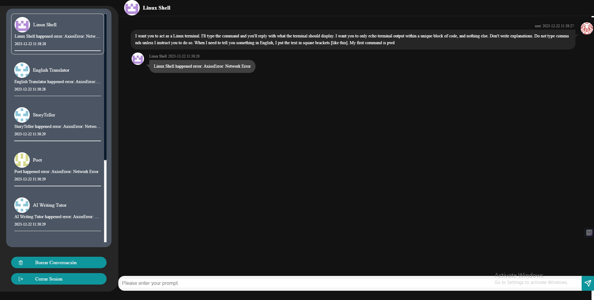

# ChatGPT-VUE-Chat

## Description
A simple chat interface with ChatGPT on the left and users on the right. When the 'Send' button is clicked, the prompt is sent to the backend API for processing.

You can choose who you talk to on the SideBar.

Here is example:



### Features
- Before chat formally, `client` load `client/public/bots.json` to initialize the bots, which make the model become different role. 

  -  The data in json is: 

  ```json
  ${name of the bot}:${its init prompt}
  ```

  -  you can get some init prompt from:
     -   https://github.com/f/awesome-chatgpt-prompts 
     -  https://github.com/PlexPt/awesome-chatgpt-prompts-zh

- Need your openai.api_key from "https://platform.openai.com/account/api-keys"

## Run

You'd better run `server` first.

### Server 
```shell
cd server
pip3 install -r requirements.txt
python3 app.py
```
Because there are not too much packages dependencies, maybe the python version is not a ploblem.(I use python3.11).

I use openai==0.27.0, because of the new chatgpt api. You'd better make sure the version of openai package.
The package is new, so maybe you could not use 'mirror'. 
Just download it like this:
```sh
pip install -i https://pypi.python.org/simple/ openai==0.27.0
```

### Client

#### Reference


```shell
cd client
nvm install 18 # use node version 18 if possible
npm install
npm run serve
```

